# 올바름 인력관리시스템 화면 명세서

| 항목 | 내용 |
| --- | --- |
| 문서 유형 | 화면 명세서 |
| 작성일 | 2026-07-20 |
| 대상 시스템 | 올바름 인력관리시스템(Ollbareun) |
| 적용 대상 | 관리자, 최고 관리자, 현장 근무자 |
| 지원 환경 | PC·모바일 웹, PWA 지원 브라우저 |
| 관련 문서 | 인력관리시스템 요구사항분석서, `docs/기능명세서.md` |

## 1. 문서 목적

본 문서는 올바름 인력관리시스템의 화면별 목적, 진입 경로, 표시 항목, 입력 항목, 사용자 동작, 화면 이동 및 예외 처리를 정의한다. 화면 개발, 검수, 사용자 교육 및 고객 인수의 기준으로 사용한다.

## 2. 공통 화면 원칙

### 2.1 화면 구성

- 관리자 화면은 PC에서 좌측 사이드바와 본문 영역으로 구성한다.
- 모바일 관리자 화면은 상단 헤더와 햄버거 메뉴를 사용한다.
- 현장 근무자 화면은 모바일 사용을 우선하며 큰 터치 영역과 읽기 쉬운 글자를 제공한다.
- 목록 화면은 화면 제목, 조회 조건, 주요 작업 버튼, 결과 목록 순으로 배치한다.
- 등록·수정 화면은 화면 제목, 입력 폼, 저장·삭제·취소 버튼 순으로 배치한다.
- 처리 시간이 필요한 화면은 로딩 상태를 표시하고 중복 실행을 방지한다.

### 2.2 공통 상호작용

| 구분 | 기준 |
| --- | --- |
| 조회 | 입력한 조건으로 결과를 다시 조회한다. 조건이 없으면 전체 또는 기본 기간을 조회한다. |
| 신규 | 등록 화면으로 이동한다. |
| 저장 | 필수값과 형식을 검증한 후 저장한다. 성공 시 결과를 안내하고 목록 또는 상세 화면으로 이동한다. |
| 삭제 | 확인창에서 재확인한 후 삭제한다. 취소 시 현재 화면을 유지한다. |
| 오류 | 입력 항목 인근 또는 화면 알림 영역에 이해하기 쉬운 메시지를 표시한다. |
| 빈 결과 | 데이터가 없음을 안내하고 가능한 다음 행동을 함께 제공한다. |
| 뒤로가기 | 이전 목록 또는 업무 시작 화면으로 이동한다. |

### 2.3 공통 접근성 및 반응형

- 버튼과 링크는 키보드 포커스 및 명확한 텍스트를 제공한다.
- 모바일 표는 가로 스크롤 또는 카드형 정보로 읽을 수 있어야 한다.
- 상태는 색상만으로 구분하지 않고 텍스트를 함께 표시한다.
- 위치·카메라·알림 권한이 필요한 기능은 요청 목적과 거부 시 대안을 안내한다.

## 3. 전체 화면 목록

### 3.1 공통 및 인증 화면

| 화면 ID | 화면명 | 경로 | 사용자 | 주요 기능 |
| --- | --- | --- | --- | --- |
| COM-001 | 서비스 선택 | `/` | 전체 | 관리자/근무자 서비스 진입 |
| COM-002 | 오프라인 안내 | `/offline` | 전체 | 네트워크 연결 안내 및 재시도 |
| M-AUTH-001 | 관리자 로그인 | `/manager/auth` | 관리자 | 이메일 인증, 최초 관리자 등록 |
| G-AUTH-001 | 근무자 로그인 | `/guard` | 근무자 | 이름·연락처 인증, Passkey 진입 |

### 3.2 관리자 화면

| 화면 ID | 화면명 | 경로 |
| --- | --- | --- |
| M-001 | 관리자 대시보드 | `/manager` |
| M-EMP-001 | 직원 목록 | `/manager/employee/employees` |
| M-EMP-002 | 직원 등록 | `/manager/employee/employees/new` |
| M-EMP-003 | 직원 수정 | `/manager/employee/employees/save/{id}` |
| M-WS-001 | 근무지 목록 | `/manager/employee/worksites` |
| M-WS-002 | 근무지 등록 | `/manager/employee/worksites/new` |
| M-WS-003 | 근무지 수정 | `/manager/employee/worksites/save/{id}` |
| M-ASG-001 | 근무 배정 목록 | `/manager/employee/assignments` |
| M-ASG-002 | 근무 배정 등록 | `/manager/employee/assignments/new` |
| M-ASG-003 | 근무 배정 수정 | `/manager/employee/assignments/save/{id}` |
| M-EDU-001 | 교육자료 목록 | `/manager/safty/resources` |
| M-EDU-002 | 교육자료 등록 | `/manager/safty/resources/new` |
| M-EDU-003 | 교육자료 수정 | `/manager/safty/resources/save/{id}` |
| M-EDU-004 | 교육 이수 현황 | `/manager/safty/completions` |
| M-EDU-005 | 교육 이수 상세 | `/manager/safty/completions/detail` |
| M-EDU-006 | 교육 알림 관리 | `/manager/safty/notifications` |
| M-VID-001 | 교육영상 목록 | `/manager/safty/cloudflare` |
| M-VID-002 | 교육영상 등록 | `/manager/safty/cloudflare/new` |
| M-VID-003 | 교육영상 재생 | `/manager/safty/cloudflare/watch/{uid}` |
| M-INS-001 | 점검 현장 목록 | `/manager/inspection/sites` |
| M-INS-002 | 점검 현장 등록 | `/manager/inspection/sites/new` |
| M-INS-003 | 점검 현장 상세 | `/manager/inspection/sites/{id}` |
| M-INS-004 | 점검 이력 | `/manager/inspection/logs` |
| M-REM-001 | 특이사항 목록 | `/manager/inspection/special-remarks` |
| M-REM-002 | 특이사항 상세 | `/manager/inspection/special-remarks/{id}` |
| M-RPT-001 | 근태 리포트 | `/manager/reports/attendance` |
| M-RPT-002 | 교육 이수 리포트 | `/manager/reports/education` |
| M-SYS-001 | 근무자 로그 | `/manager/system/logs` |
| M-SYS-002 | 시스템 설정 목록 | `/manager/system/configs` |
| M-SYS-003 | 시스템 설정 등록 | `/manager/system/configs/new` |
| M-SYS-004 | 시스템 설정 수정 | `/manager/system/configs/{systemCode}` |
| M-SYS-005 | Passkey 승인 관리 | `/manager/system/passkeys` |
| M-SYS-006 | 관리자 계정 관리 | `/manager/system/admin-users` |

### 3.3 현장 근무자 화면

| 화면 ID | 화면명 | 경로 |
| --- | --- | --- |
| G-001 | 근무자 메인 | `/guard/main` |
| G-ATT-001 | 출퇴근 | `/guard/main/attendance` |
| G-EDU-001 | 안전교육 | `/guard/main/safety` |
| G-INS-001 | QR 현장점검 | `/guard/main/inspection` |
| G-INS-002 | NFC 현장점검 | `/guard/main/inspection-nfc` |
| G-REM-001 | 특이사항 보고 | `/guard/main/special-remarks` |
| G-PRF-001 | 개인 프로필 | `/guard/main/profile` |

## 4. 공통 및 인증 화면 상세

### COM-001 서비스 선택

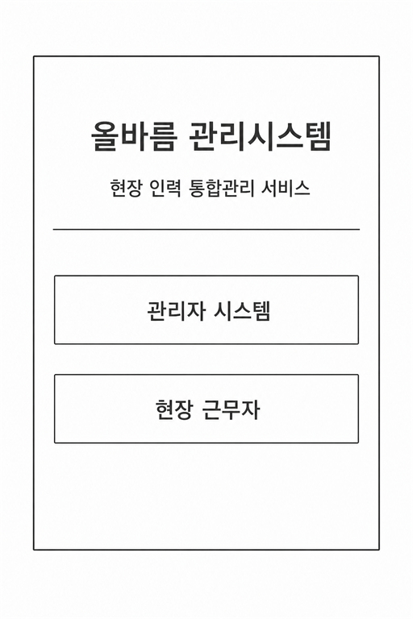

- 목적: 이용자가 관리자 또는 현장 근무자 서비스를 선택한다.
- 주요 구성:
  - 서비스명 및 안내 문구
  - `관리자 시스템` 버튼
  - `현장 근무자` 버튼
- 동작:
  - 관리자 버튼 → `M-AUTH-001` 또는 인증된 경우 `M-001`
  - 근무자 버튼 → `G-AUTH-001`

### COM-002 오프라인 안내

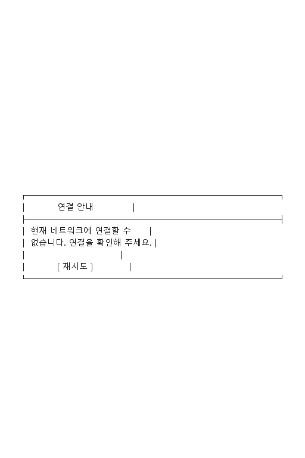

- 목적: 네트워크를 사용할 수 없을 때 현재 상태와 복구 방법을 안내한다.
- 표시: 오프라인 안내 문구, 네트워크 확인 요청, 재시도 버튼
- 동작: 재시도 시 이전 요청 또는 시작 화면을 다시 연다.

### M-AUTH-001 관리자 로그인

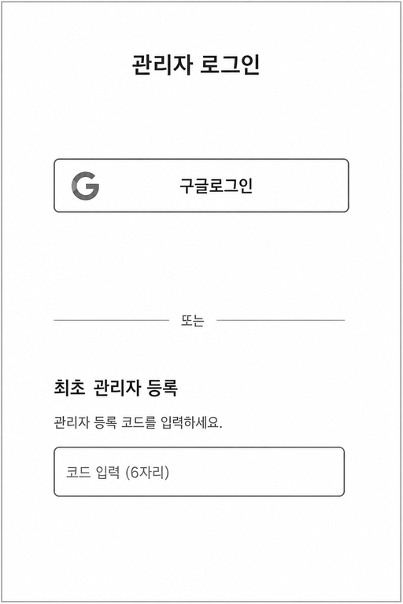

- 목적: 등록된 관리자의 신원을 확인하고 관리자 화면에 진입시킨다.
- 입력: 이메일
- 버튼: 로그인 링크 발송, 최초 관리자 등록, 이전 화면
- 처리:
  - 로그인 요청 성공 시 이메일 확인 안내를 표시한다.
  - 인증 완료 후 요청했던 관리자 화면 또는 대시보드로 이동한다.
- 최초 관리자 영역:
  - 관리자 계정이 없을 때만 표시한다.
  - 등록 이메일과 최초 관리자 등록 코드를 입력받는다.
- 오류: 미등록 관리자, 잘못된 등록 코드, 만료·실패한 인증은 원인별 메시지를 표시한다.

### G-AUTH-001 근무자 로그인

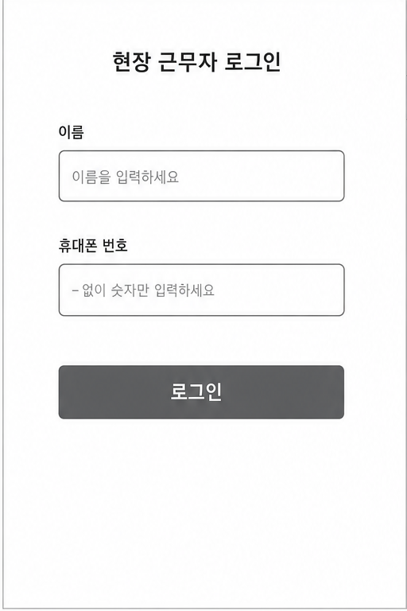

- 목적: 현장 근무자의 간편 인증 또는 Passkey 로그인을 제공한다.
- 입력: 이름, 연락처
- 버튼: 로그인, Passkey 로그인, Passkey 사용 신청/등록
- 처리:
  - 이름과 연락처 일치 시 `G-001`로 이동한다.
  - 이름은 공백 제거 기준, 연락처는 숫자 정규화 기준으로 확인한다.
- 오류:
  - 미등록 또는 불일치 정보 안내
  - 퇴직자는 이용 불가 안내
  - Passkey 미지원·미등록·승인 대기 상태 안내

## 5. 관리자 공통 레이아웃

### 5.1 PC 레이아웃

- 좌측: 로고, 대시보드, 직원관리, 안전교육, 현장점검, 리포트, 시스템관리 메뉴
- 상단: 현재 화면명, 사용자 정보, 로그아웃
- 본문: 화면별 조회·입력·현황 영역

### 5.2 모바일 레이아웃

- 상단 헤더: 메뉴 열기, 화면명, 사용자 동작
- 메뉴: 햄버거 버튼으로 열고 항목 선택 또는 바깥 영역 선택 시 닫는다.
- 본문: 카드 및 스크롤 가능한 표를 사용한다.

## 6. 관리자 화면 상세

### M-001 관리자 대시보드

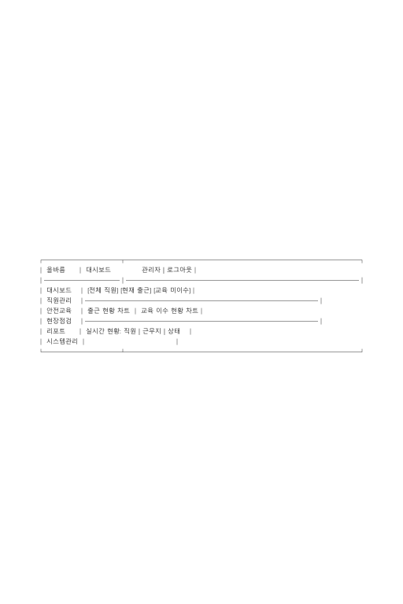

- 목적: 인력, 출근, 교육 현황을 한 화면에서 파악한다.
- 상단 요약 카드: 전체 재직 인원, 현재 출근 인원, 교육 미이수 인원
- 차트: 최근 출근 현황, 안전교육 이수 현황
- 현황 표: 직원명, 근무지, 출근 시각, 교육 여부, 근무 상태
- 상태:
  - 데이터 조회 중 로딩 표시
  - 데이터가 없으면 각 영역별 빈 상태 표시
  - 모바일에서는 차트와 표를 세로로 배치

### M-EMP-001 직원 목록

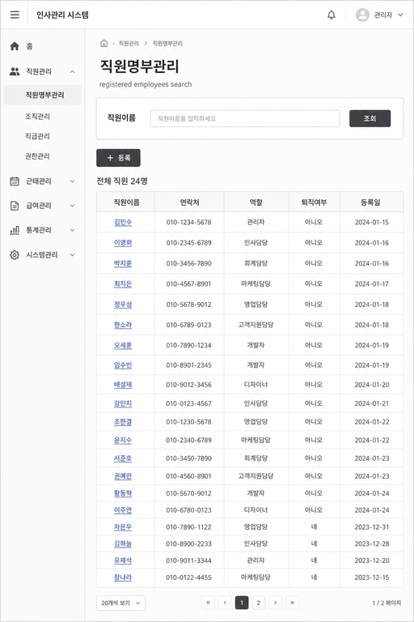

- 목적: 직원 정보를 조회하고 등록·수정 화면으로 이동한다.
- 조회 조건: 이름, 연락처, 직무, 퇴직 여부
- 목록 항목: 이름, 연락처, 직무, 재직 상태, 등록일
- 버튼: 조회, 신규 등록
- 이동: 행 또는 이름 선택 → `M-EMP-003`, 신규 등록 → `M-EMP-002`

### M-EMP-002 직원 등록 / M-EMP-003 직원 수정

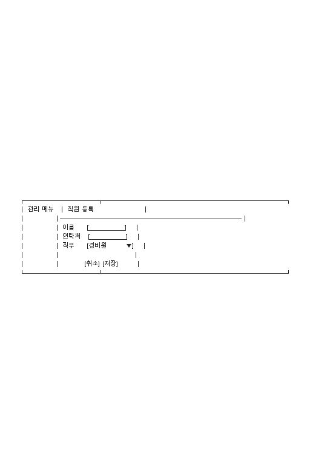

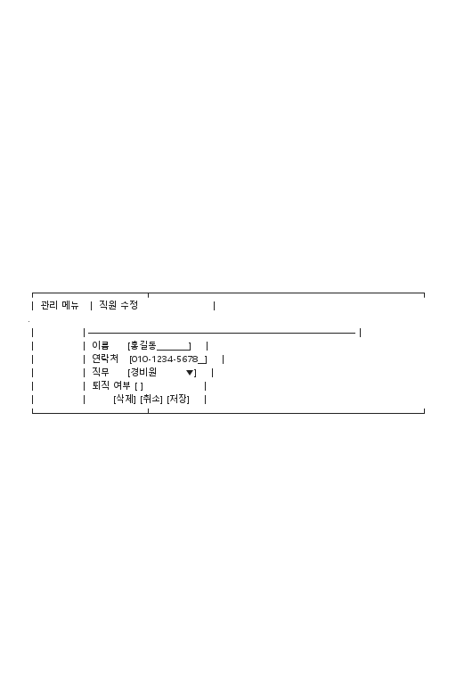

| 항목 | 유형 | 필수 | 기준 |
| --- | --- | --- | --- |
| 이름 | 텍스트 | Y | 공백만 입력 불가 |
| 연락처 | 전화번호 | Y | 숫자 기준으로 정규화 |
| 직무 | 선택 | Y | 경비원, 미화원, 파견 |
| 퇴직 여부 | 체크 | 수정 시 | 신규 등록은 재직 상태 |

- 버튼: 저장, 취소, 삭제(수정 화면)
- 성공: 안내 후 직원 목록으로 이동
- 오류: 필수값, 허용 직무, 중복·저장 오류를 표시

### M-WS-001 근무지 목록

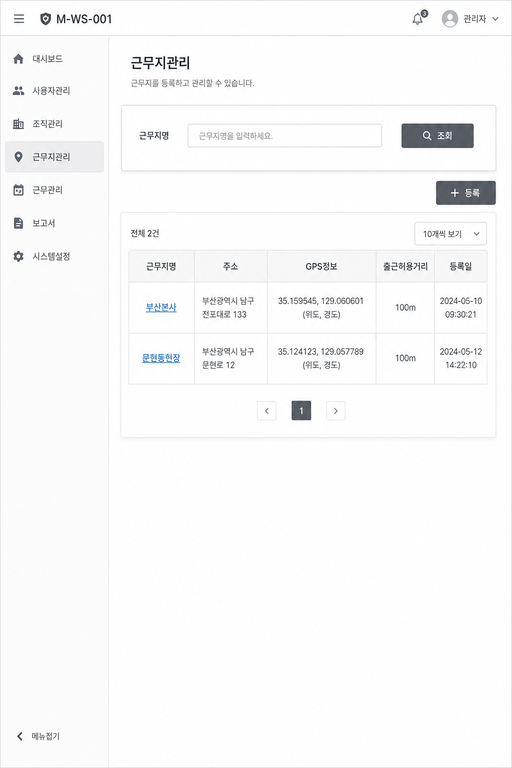

- 조회 조건: 근무지명, 주소
- 목록 항목: 근무지명, 주소, 위도·경도, 출근 인정 반경
- 버튼: 조회, 신규 등록
- 이동: 행 선택 → `M-WS-003`, 신규 등록 → `M-WS-002`

### M-WS-002 근무지 등록 / M-WS-003 근무지 수정

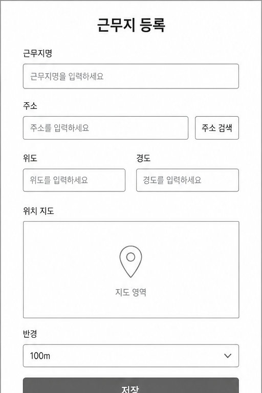

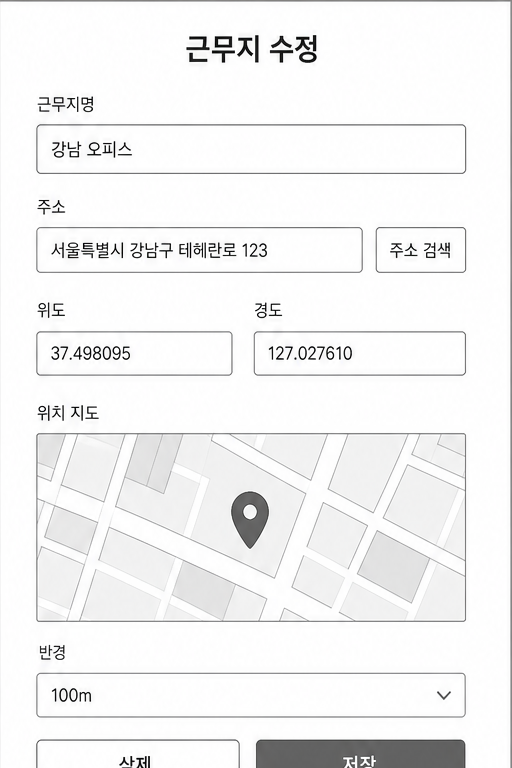

| 항목 | 유형 | 필수 | 기준 |
| --- | --- | --- | --- |
| 근무지명 | 텍스트 | Y | 공백만 입력 불가 |
| 주소 | 주소 검색·텍스트 | Y | 도로명주소 검색 지원 |
| 위도 | 숫자 | Y | 유효한 위도 |
| 경도 | 숫자 | Y | 유효한 경도 |
| 인정 반경 | 숫자(m) | Y | 1 이상의 정수 |

- 보조 기능: 주소 검색, 지도 위치 선택, 주소의 좌표 변환
- 버튼: 저장, 취소, 삭제(수정 화면)
- 오류: 지도 연동 실패 시 직접 입력을 유지하고 안내한다.

### M-ASG-001 근무 배정 목록

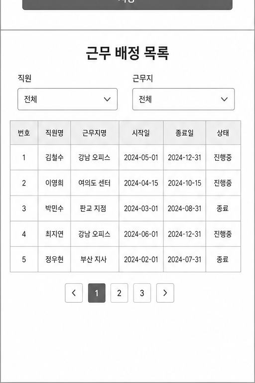

- 조회 항목: 직원, 근무지, 시작일, 종료일
- 목록 항목: 직원명, 근무지명, 배정 기간
- 버튼: 조회, 신규 등록
- 이동: 행 선택 → `M-ASG-003`, 신규 등록 → `M-ASG-002`

### M-ASG-002 근무 배정 등록 / M-ASG-003 근무 배정 수정

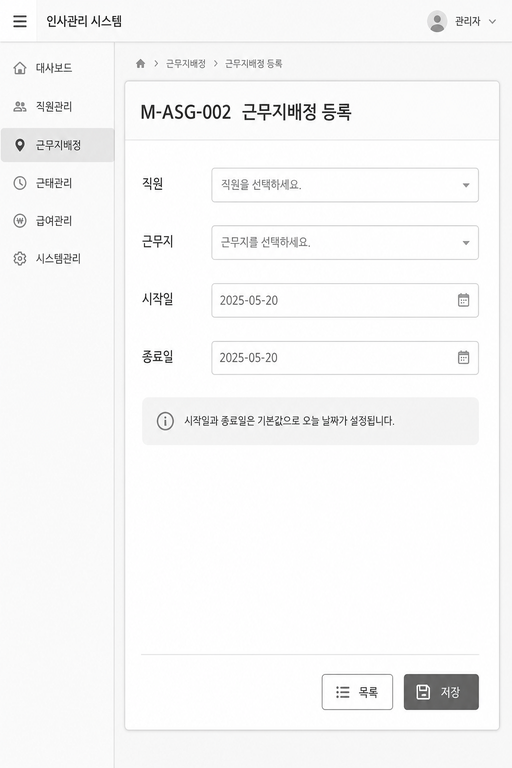

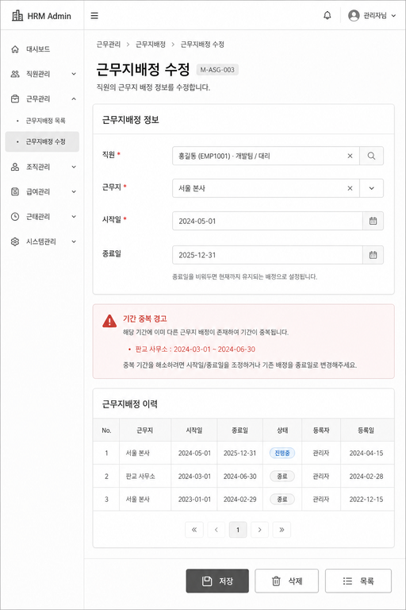

- 입력: 직원 선택, 근무지 선택, 시작일, 종료일
- 버튼: 저장, 취소, 삭제(수정 화면)
- 검증:
  - 종료일은 시작일보다 빠를 수 없다.
  - 같은 직원의 기존 배정과 기간이 겹치면 저장하지 않고 중복 안내를 표시한다.

### M-EDU-001 교육자료 목록

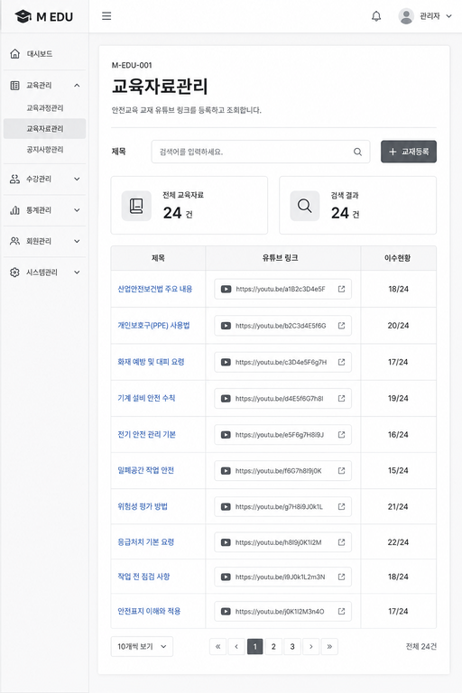

- 목록 항목: 제목, 영상 정보, 등록일, 수정일
- 버튼: 신규 등록, 수정/상세, 영상 관리
- 빈 상태: 등록된 교육자료가 없음을 안내하고 등록 버튼을 제공한다.

### M-EDU-002 교육자료 등록 / M-EDU-003 교육자료 수정

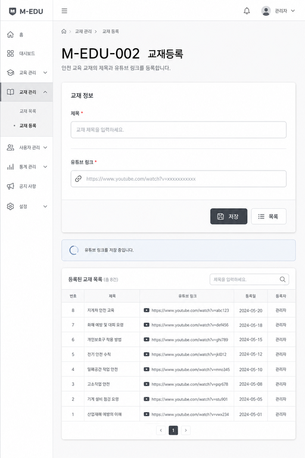

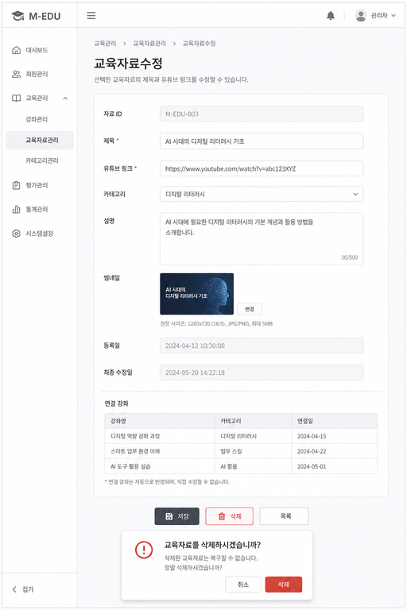

- 입력: 교육 제목, 영상 URL 또는 영상 식별 정보
- 버튼: 저장, 취소, 삭제(수정 화면)
- 검증: 제목과 재생 가능한 영상 정보의 필수 여부를 확인한다.
- 성공: 교육자료 목록으로 이동한다.

### M-EDU-004 교육 이수 현황 / M-EDU-005 교육 이수 상세

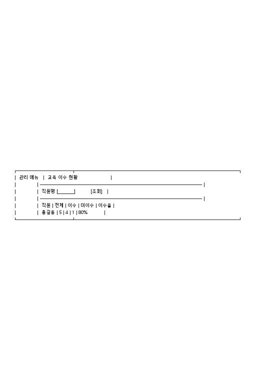

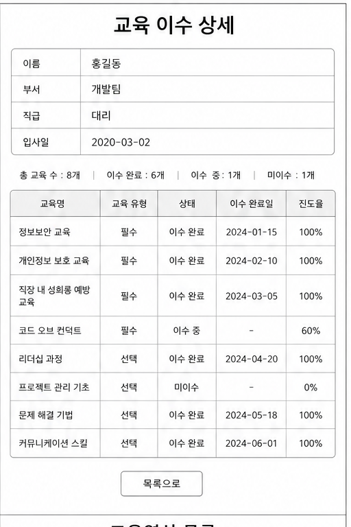

- 요약 목록: 직원명, 전체 교육 수, 이수 수, 미이수 수, 이수율
- 상세 목록: 교육자료명, 이수 상태, 이수 일시
- 동작: 직원 행 선택 시 해당 직원의 상세 화면을 연다.
- 상태 표시: 완료, 미완료를 텍스트와 배지로 표시한다.

### M-EDU-006 교육 알림 관리

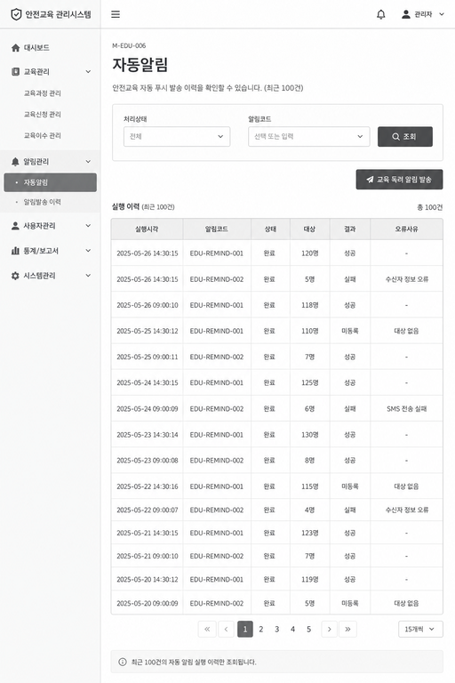

- 대상 목록: 직원명, 미이수 건수, 푸시 구독 여부
- 발송 영역: 대상 선택, 교육 독려 알림 발송
- 실행이력: 실행 시각, 유형, 상태, 대상 수, 성공·실패·미수신 수, 오류 사유
- 필터: 처리 상태, 알림 코드
- 확인: 발송 전 대상과 건수를 확인한다.
- 오류: 구독 없음, 만료 구독, 서버·네트워크 실패를 구분하여 표시한다.

### M-VID-001~003 교육영상 관리

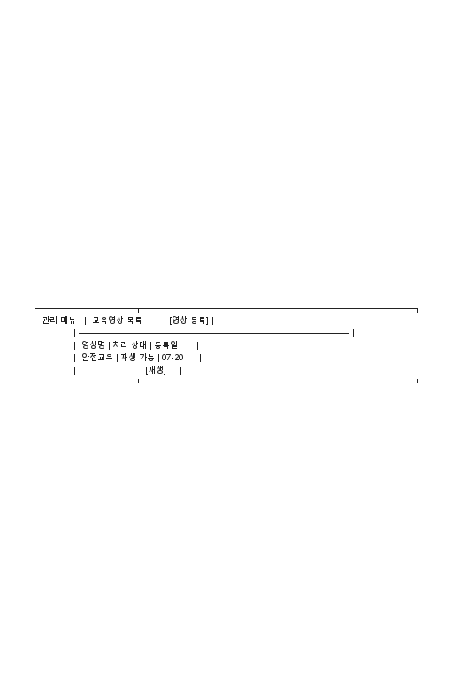

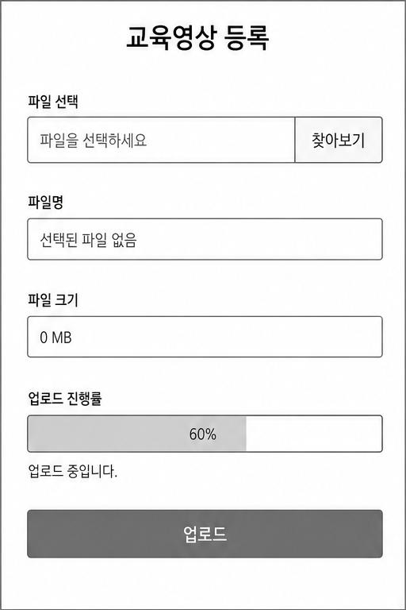

- 영상 목록: 제목/UID, 처리 상태, 등록 시각, 재생 이동
- 영상 등록: 업로드 파일 선택, 업로드 진행 상태, 완료 결과
- 영상 재생: 재생 플레이어, 처리중·실패 상태 안내, 목록 이동

### M-INS-001 점검 현장 목록

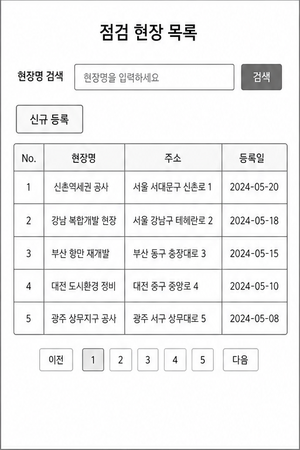

- 조회 조건: 현장명
- 목록 항목: 현장명, 연결 근무지, 주소, 등록일
- 버튼: 조회, 신규 등록
- 이동: 행 선택 → `M-INS-003`, 신규 등록 → `M-INS-002`

### M-INS-002 점검 현장 등록 / M-INS-003 점검 현장 상세

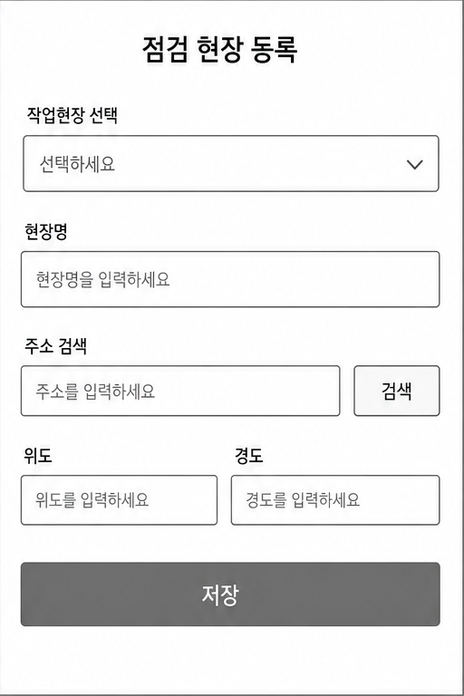

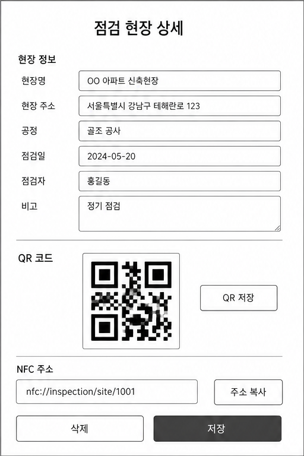

- 입력: 연결 근무지, 현장명, 주소, 위도, 경도
- 상세 추가 영역:
  - 현장점검 QR 코드 미리보기
  - QR 이미지 저장 버튼
  - NFC/점검 주소 표시 및 복사
- 버튼: 저장, 삭제, 목록
- 오류: 근무지 미선택, 필수값·GPS 오류를 표시한다.

### M-INS-004 점검 이력

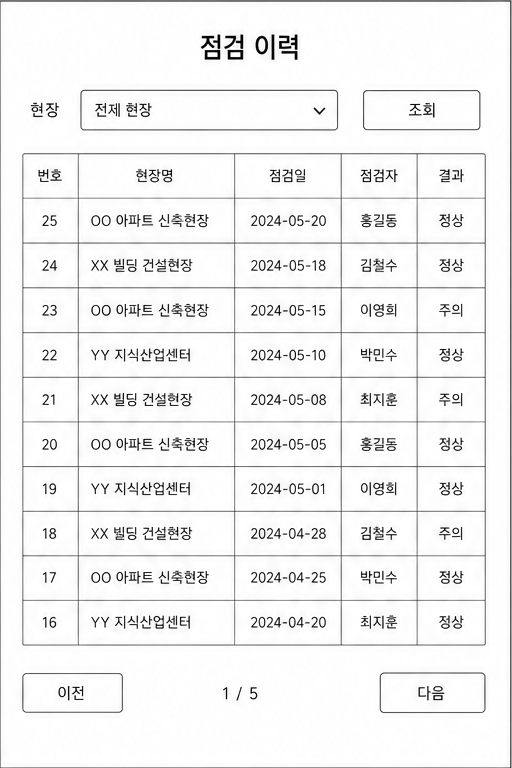

- 조회 조건: 근무지
- 목록 항목: 점검 시각, 근무자, 직무, 근무지, 현장
- 정렬: 최신 점검순
- 빈 상태: 조회 조건에 해당하는 점검 기록이 없음을 표시한다.

### M-REM-001 특이사항 목록 / M-REM-002 특이사항 상세

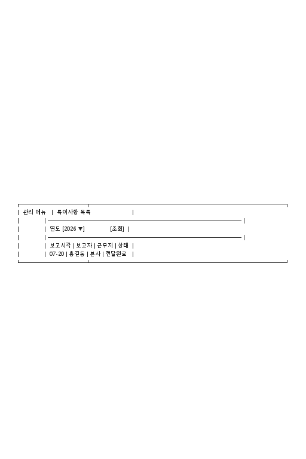

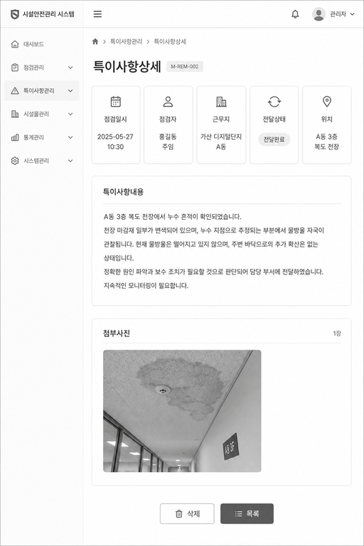

- 목록 조회 조건: 연도
- 목록 항목: 보고 시각, 보고자, 근무지, 내용 요약, 사진 여부, 전달 상태
- 상세 항목: 전체 내용, 보고자, 근무지, 위치, 사진, 보고·전달 시각과 상태
- 버튼: 상세 보기, 삭제, 목록
- 사진: 선택 시 확대해 확인할 수 있도록 표시한다.

### M-RPT-001 근태 리포트

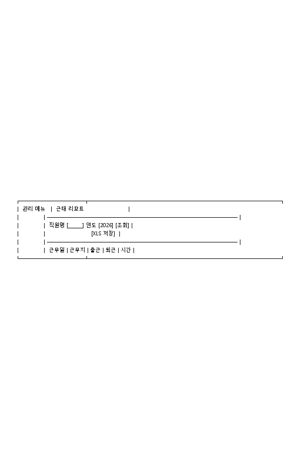

- 조회 조건: 직원 이름, 연도
- 결과: 근무일, 직원, 근무지, 출근·퇴근 시각, 근무시간
- 버튼: 조회, XLS 다운로드
- 규칙: 다운로드 파일은 화면의 현재 조회 조건과 결과를 반영한다.

### M-RPT-002 교육 이수 리포트

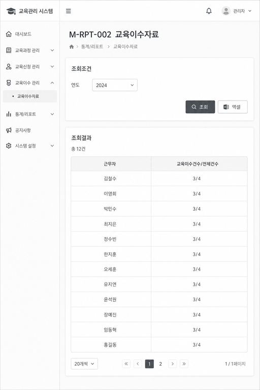

- 조회 조건: 연도
- 결과: 직원명, 해당 연도 이수 건수, 전체 교육 건수, 이수율
- 버튼: 조회, XLS 다운로드
- 빈 상태: 해당 연도 결과 없음 안내

### M-SYS-001 근무자 로그

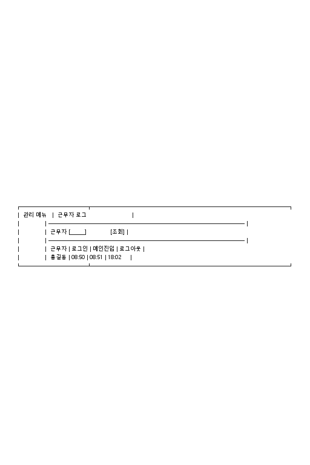

- 목록 항목: 근무자, 로그인 시각, 메인 진입 시각, 로그아웃 시각
- 정렬: 최신 로그인순
- 동작: 필요 시 로그 삭제 전 확인창을 표시한다.

### M-SYS-002 시스템 설정 목록

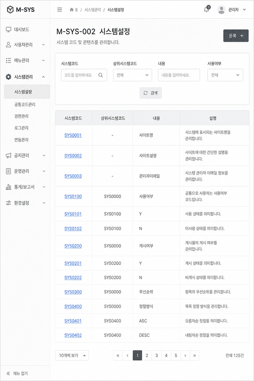

- 목록 항목: 시스템 코드, 설명, 설정 내용 요약
- 버튼: 신규 등록
- 이동: 항목 선택 → `M-SYS-004`, 신규 등록 → `M-SYS-003`

### M-SYS-003 시스템 설정 등록 / M-SYS-004 시스템 설정 수정

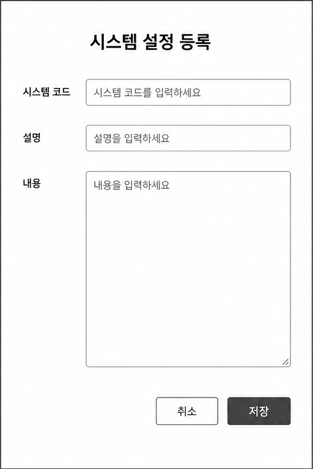

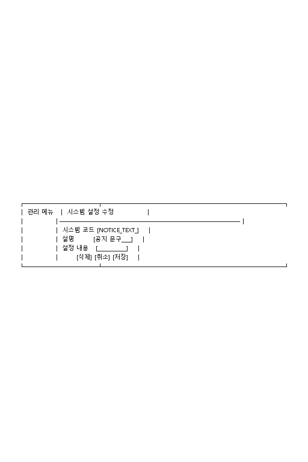

- 입력: 시스템 코드, 설정 내용, 설명
- 버튼: 저장, 취소, 삭제(수정 화면)
- 검증: 시스템 코드는 필수이며 중복될 수 없다.

### M-SYS-005 Passkey 승인 관리

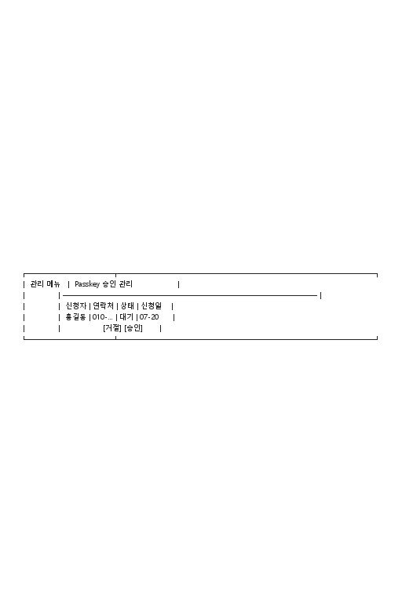

- 목록 항목: 신청자, 연락처, 재직 상태, 처리 상태, 신청·검토·등록·폐기 시각
- 상태: 대기, 승인, 거절, 등록 완료, 폐기
- 버튼: 승인, 거절, 폐기
- 처리:
  - 대기 상태에서 승인 또는 거절 가능
  - 등록 완료 상태에서 폐기 가능
  - 처리 전 확인창을 표시하고 완료 후 목록을 갱신

### M-SYS-006 관리자 계정 관리

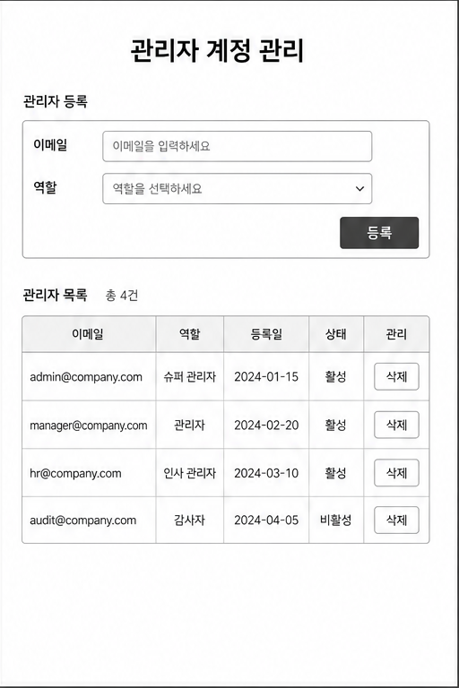

- 대상: 최고 관리자
- 목록 항목: 이메일, 역할, 등록 상태, 생성·수정 시각
- 등록 입력: 이메일, 역할
- 버튼: 관리자 등록, 역할 변경, 삭제
- 권한 처리: 일반 관리자에게는 변경 기능을 노출하지 않거나 권한 오류를 표시한다.

## 7. 현장 근무자 공통 레이아웃

- 상단: 이전 화면 또는 홈 이동, 화면 제목
- 본문: 현재 근무 정보와 업무별 주요 동작
- 하단/주요 영역: 큰 크기의 실행 버튼
- 글자 크기: 개인 프로필에서 선택한 설정을 근무자 화면에 반영한다.
- 세션이 없으면 근무자 로그인 화면으로 이동한다.

## 8. 현장 근무자 화면 상세

### G-001 근무자 메인

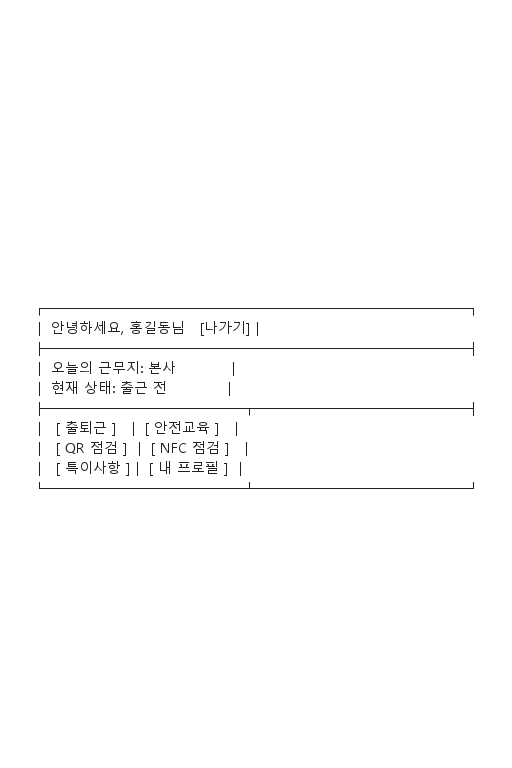

- 목적: 오늘의 근무 상태와 주요 업무 메뉴를 제공한다.
- 표시: 인사말, 근무자명, 오늘 근무지, 배정 기간, 현재 출근 상태
- 메뉴 카드: 출퇴근, 안전교육, QR/NFC 점검, 특이사항, 개인 프로필
- 부가 동작: 푸시 알림 등록, 로그아웃
- 배정 없음: 관리자에게 배정을 요청하라는 안내를 표시한다.

### G-ATT-001 출퇴근

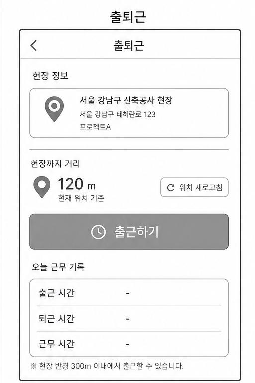

- 표시: 근무자명, 오늘 근무지, 인정 반경, 현재 출퇴근 상태, 출근·퇴근 시각
- 위치 영역: 위치 확인 상태, 근무지까지 거리, 반경 충족 여부
- 버튼 상태:
  - 미출근 + 반경 안: `출근하기` 활성화
  - 미출근 + 반경 밖/위치 없음: 출근 비활성화 및 사유 표시
  - 출근 완료 + 미퇴근: `퇴근하기` 활성화
  - 퇴근 완료: 완료 상태 표시
- 권한 거부: 브라우저 위치 권한 설정 방법과 재시도 버튼을 제공한다.

### G-EDU-001 안전교육

- 자료 카드: 교육 제목, 영상, 이수 상태
- 동작: 영상 재생, 교육 이수 완료
- 버튼 상태:
  - 미이수: 이수 완료 버튼 활성화
  - 완료: 완료 일시 표시 및 중복 처리 방지
- 빈 상태: 현재 등록된 교육이 없음을 표시한다.

### G-INS-001 QR 현장점검

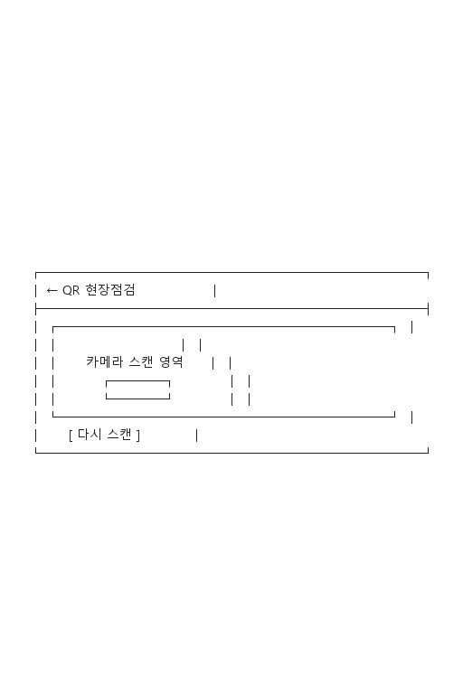

- 구성: 카메라 스캔 영역, 직접 입력/재시도, 점검 결과
- 처리 순서:
  1. 카메라 권한 요청
  2. QR 인식
  3. 현장 정보 확인
  4. 점검 기록 저장
  5. 성공 시 현장명과 점검 시각 표시
- 오류: 카메라 거부, 인식 실패, 잘못된 QR, 삭제된 현장, 저장 실패를 구분해 안내한다.

### G-INS-002 NFC 현장점검

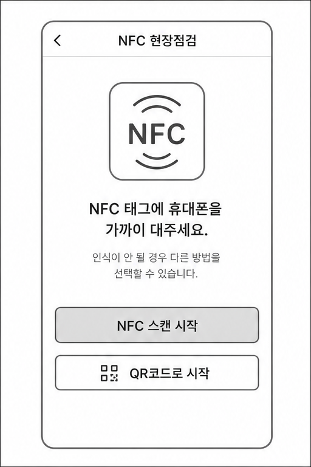

- 구성: NFC 점검 안내, 태그 읽기 상태, 감지 결과
- 처리: 태그의 점검 정보를 읽어 현장 확인 후 점검 기록을 저장한다.
- 미지원: 브라우저·기기가 NFC를 지원하지 않으면 QR 점검 이동 버튼을 제공한다.

### G-REM-001 특이사항 보고

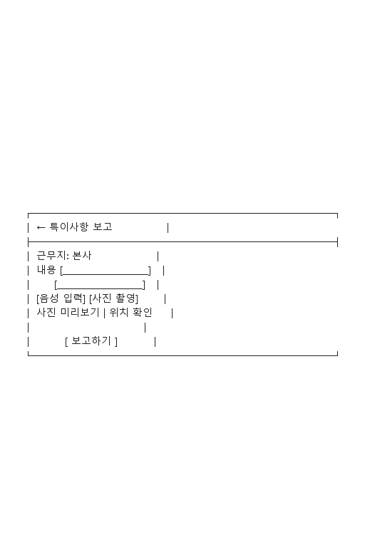

| 항목 | 유형 | 필수 | 설명 |
| --- | --- | --- | --- |
| 근무지 | 자동 표시/선택 | Y | 현재 배정 근무지 기준 |
| 보고 내용 | 여러 줄 텍스트 | Y | 음성 입력 지원 |
| 사진 | 촬영/파일 | N | 미리보기와 재선택 지원 |
| 위치 | 현재 위치 | N | 권한 허용 시 자동 기록 |

- 버튼: 음성 입력, 사진 촬영/선택, 위치 확인, 보고하기
- 제출 상태: 전송 중 중복 제출을 막고 완료 또는 실패 결과를 표시한다.
- 위치 실패: 위치 없이 계속 보고할 수 있음을 안내한다.

### G-PRF-001 개인 프로필

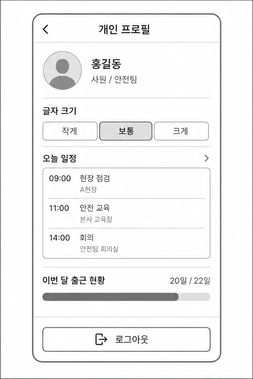

- 기본 정보: 근무자명
- 근무 일정: 배정 기간, 근무지
- 월별 근태: 연월, 출근일수, 총 근무시간
- 조회 범위: 최근 1년
- 접근성 설정: 글자 크기 선택 및 즉시 적용
- 버튼: 메인으로 이동, 로그아웃

## 9. 주요 화면 이동 흐름

### 9.1 관리자

`서비스 선택 → 관리자 로그인 → 대시보드 → 업무 메뉴 → 목록 → 등록/수정 → 저장 → 목록`

### 9.2 근무자 간편 로그인

`서비스 선택 → 근무자 로그인 → 근무자 메인 → 출퇴근/교육/점검/보고/프로필 → 근무자 메인`

### 9.3 근무자 Passkey 등록

`근무자 간편 인증 → Passkey 신청 → 관리자 승인 → 근무자 Passkey 등록 → Passkey 로그인 → 근무자 메인`

### 9.4 현장점검

`근무자 메인 → QR 또는 NFC 선택 → 현장 태그 인식 → 유효성 확인 → 점검 저장 → 완료 안내`

## 10. 화면 검수 기준

- 모든 화면 경로가 인증 및 사용자 역할에 맞게 접근 통제되어야 한다.
- PC와 모바일에서 메뉴가 가려지지 않고 핵심 기능을 사용할 수 있어야 한다.
- 목록의 조회 조건, 화면 결과, 다운로드 결과가 서로 일치해야 한다.
- 등록·수정·삭제 후 결과 안내와 목록 갱신이 정확해야 한다.
- 필수값 누락과 잘못된 형식은 저장 전에 명확히 안내되어야 한다.
- 출근 버튼은 위치·배정·현재 근태 상태에 따라 정확히 활성화되어야 한다.
- 카메라, 위치, 알림, NFC 권한 거부 시 사용자가 다음 행동을 알 수 있어야 한다.
- 교육 이수와 점검·특이사항 처리 결과가 관리자 화면에 반영되어야 한다.
- 빈 데이터, 로딩, 오류 상태에서 화면이 깨지지 않아야 한다.
- 최고 관리자 전용 버튼은 권한이 없는 사용자에게 허용되지 않아야 한다.
